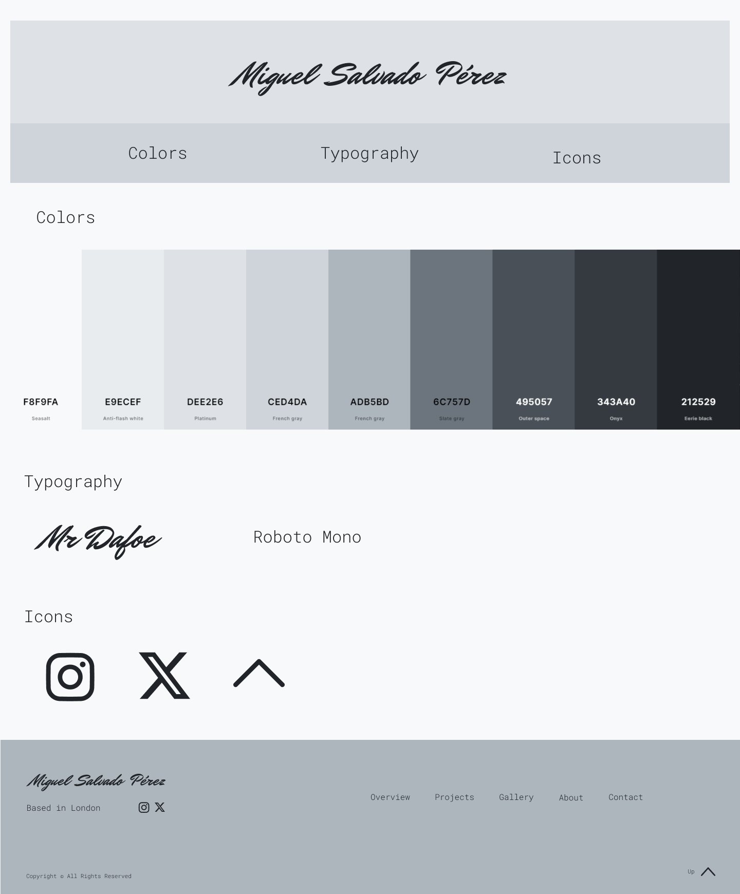
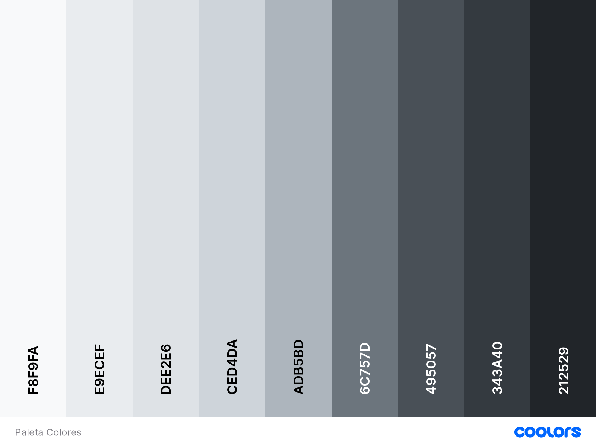
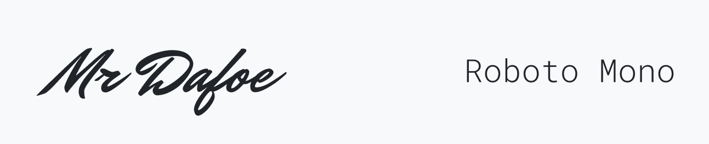
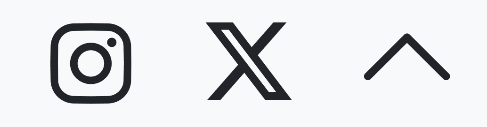
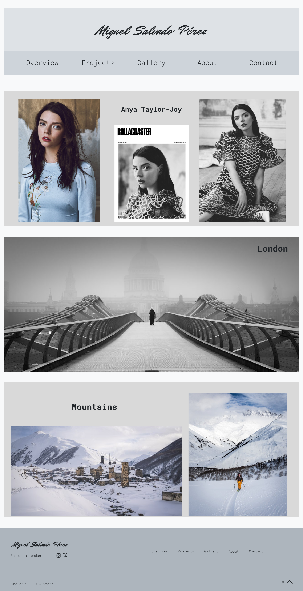
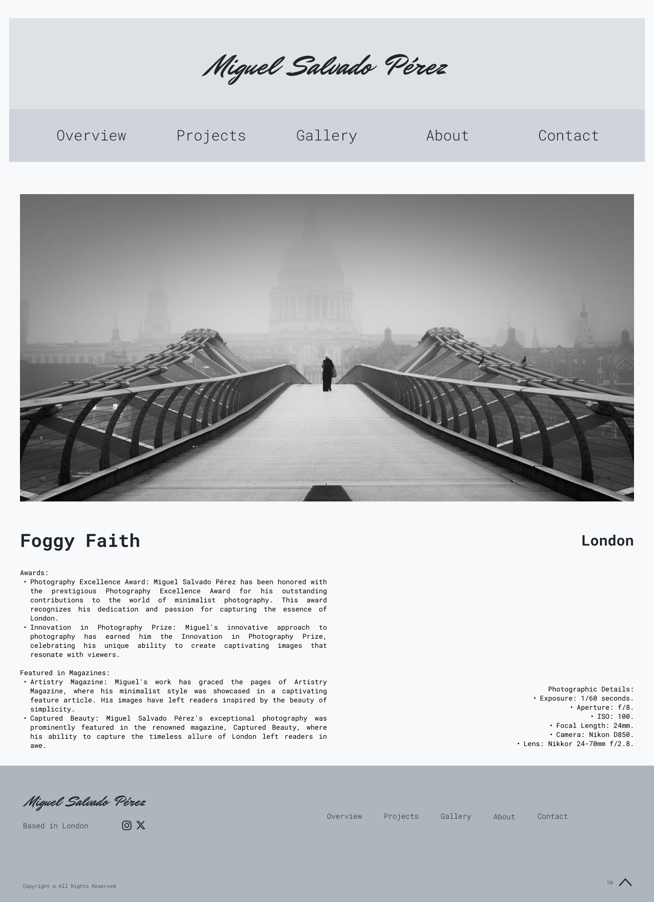
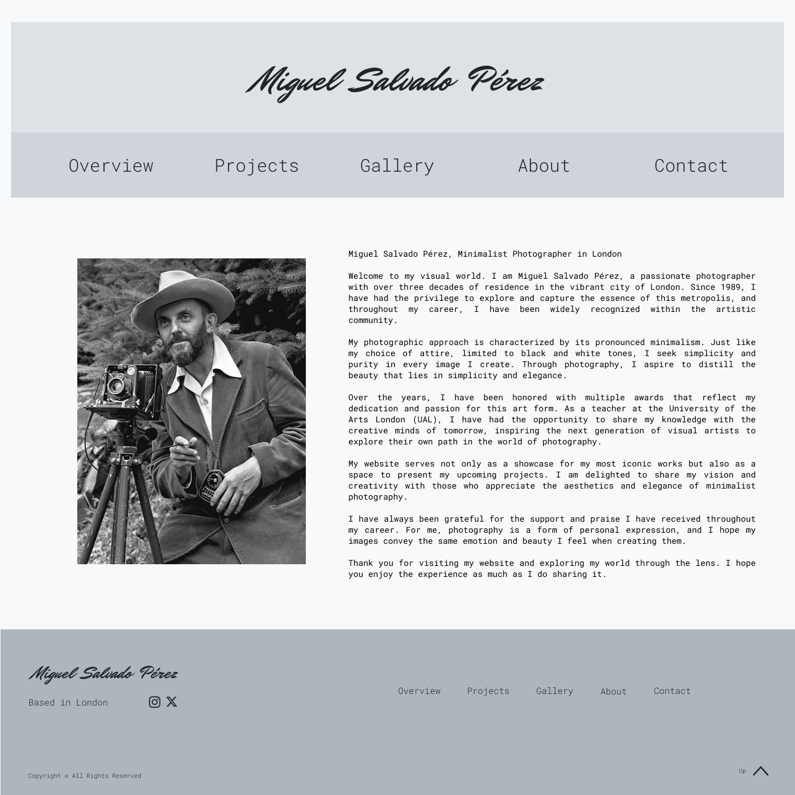
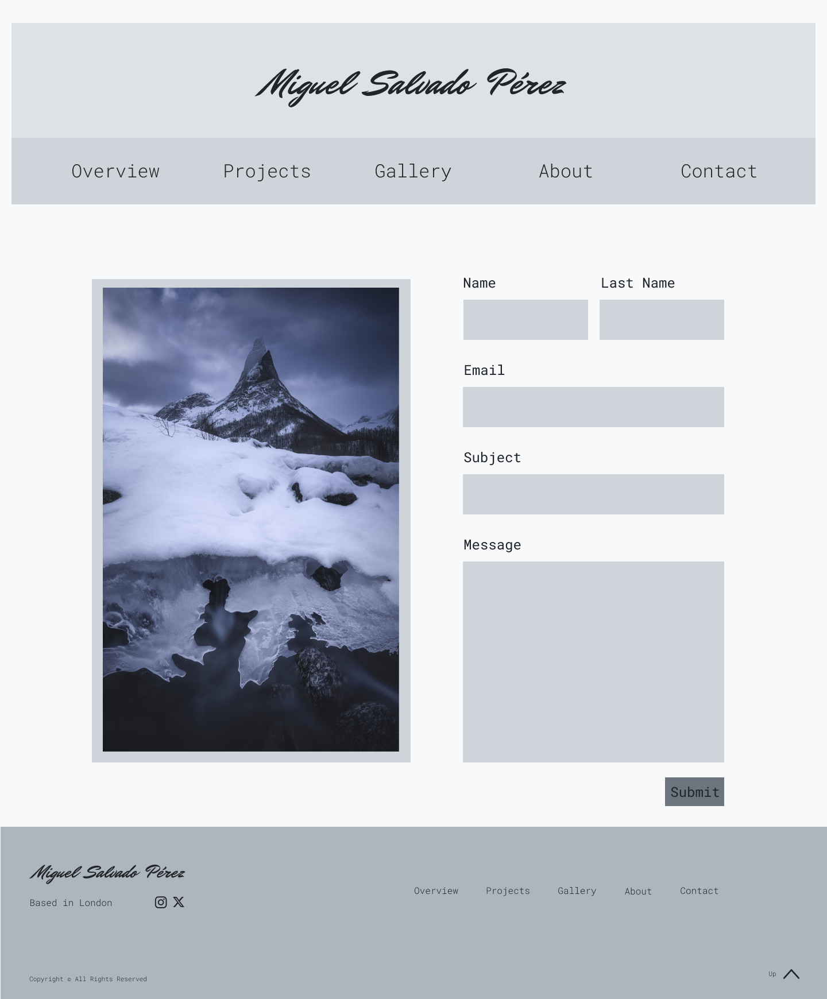

# Web Miguel Salvado

## Equipo desarrollo
- Adrián Merino Gamaza - amergam1012@g.educaand.es - https://github.com/AdriMG10
- Ricardo Gabriel Moreno Cantea - rmorcan@g.educaand.es - https://github.com/RickyCT13

---

# 1. Web

## 1.1 Público Objetivo
El público objetivo de esta web va a ser principalmente gente del sector que quiera conocer el trabajo de Miguel Salvado, alumnos de su universidad y personas interesadas en el mundo de la fotografía.

## 1.2 Tipo de web
Web centrada en exponer los trabajos fotográficos más reconocidos y próximos proyectos de Miguel Salvado. Como web de un fotógrafo, la mayor parte de esta estará formada por sus fotografías. Las fotografías incluyen información relevante sobre ella. También se explica quién es Miguel Salvado y un formulario para contactar con él.

## 1.3 Elementos de diseño
#### 1.3.1 [Overview](#overview) - Landing page
- Fotos destacadas de Miguel Salvado con grill 12. Si clickas una fotografía vas a Gallery.

#### 1.3.2 [Projects](#projects)
- Se muestran los distintos proyectos con fotos destacadas y el nombre.

#### 1.3.3 [Gallery](#gallery) - Página de detalle
- Se puede acceder a través de Overview o Projects haciendo click en la imagen.
- Si se clicka en los lados de la imagen se pasa de foto y se muestran sus detalles.
- En la página se muestra la fotografía, el nombre debajo a la izquierda, el nombre del proyecto debajo a la derecha, bajo el nombre un párrafo con los galardones y apariciones y bajo el nombre del proyecto información técnica de la fotografía.

#### 1.3.5 [About](#about)
- Descripción sobre Miguel Salvado en el lado derecho y foto personal del mismo tamaño a su izquierda.
  
#### 1.3.4 [Contact](#contact)
- Formulario de contacto mediante e-mail.

## 1.4 Lenguajes de programación usados
- HTML
- CSS

## 1.5 Tecnologías usadas
- Parcel
- SCSS
- npm

# 2. Guía de estilos

## 2.1 Colores
>

## 2.2 Tipografía
>
- Mr Dafoe → Nombre, título web, manuscrita, personal.
- Roboto Mono → Resto del texto. Contrasta con la tipografía del título, aludiendo a la dualidad que representa la obra del cliente.

## 2.3 Iconos
>
- Monocolor
- Redes sociales: Instagram - X
- Flecha arriba

---

# 3. Diseño

## 3.1 Wireframes de la web

### 3.1.1 Página Overview
>

### 3.1.2 Página Projects
>

### 3.1.3 Página Gallery
>

### 3.1.4 Página About
>

### 3.1.5 Página Contact
>

## 3.2 Enlace proyecto Figma
>[Proyecto. Wireframing con Figma](https://www.figma.com/file/3VhYUD0gRrPuNtlOq9kxoa/Proyecto-UT2.-Wireframing-con-Figma?type=design&t=ptQFpWPhTgs9VpSc-6)

[Inicio README](#top)